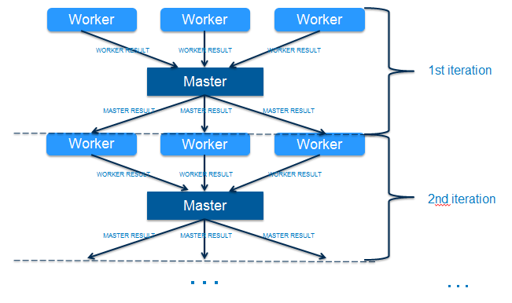

Welcome to Guagua
=================

**Guagua**, a sub-project of Shifu, is a distributed, pluggable and scalable iterative computing framework based on Hadoop MapReduce and YARN.

This graph shows the iterative computing process for **Guagua**.

Typical use cases for **Guagua** are distributed machine learning model training based on Hadoop. By using **Guagua**, we implement distributed neural network algorithm which can reduce model training time from days to hours on 500GB data sets. For distributed neural network algorithm, it is based on [Encog](http://www.heatonresearch.com/encog). For any details please check our [example](masterworkers) and [source code](https://github.com/ShifuML/shifu/tree/master/src/main/java/ml/shifu/shifu/core/dtrain).

Pages
---------

* [1. Quick Start](quickstart)
* [2. Architecture and Components](arch)
* [3. Interceptors](interceptor)
* [4. Coordinators](coordinator)
* [5. Fail Over](failover)
* [6. Neural Netwok Master Workers Iteration Using Guagua](masterworkers)
* [7. Profilers](profiler)
* [8. Configuration](configuration)
